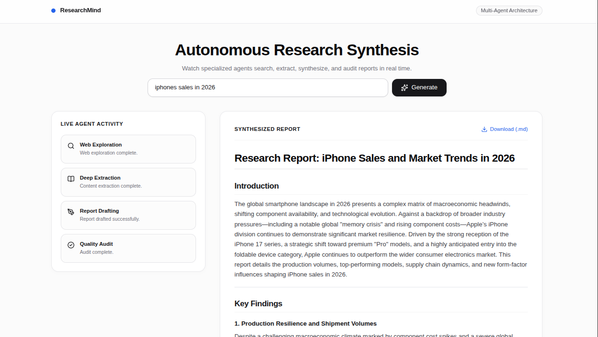

## Interface Overview



# ResearchMind: Autonomous Multi-Agent Research Engine

ResearchMind is an asynchronous, full-stack multi-agent platform designed to automate technical research, document extraction, synthesis, and peer review in real time. 

The system implements a decoupled client-server architecture. The backend coordinates specialized AI agents using LangChain and Google Gemini, exposing a non-blocking Server-Sent Events (SSE) stream via FastAPI. The frontend is an event-driven React interface that renders agent status updates and formatted reports dynamically.


---

## Agent Pipeline Overview

The pipeline executes sequentially, isolating responsibilities across four distinct agents and chains:

1. **Web Search Agent**
   - **Role:** Broad web exploration and discovery.
   - **Mechanism:** LangChain tool-calling agent integrated with the Tavily Search API.
   - **Output:** Query metadata, ranked page titles, relevant URLs, and content snippets.

2. **Extraction Agent (Reader)**
   - **Role:** Deep content retrieval.
   - **Mechanism:** HTTP retrieval with BeautifulSoup4 DOM sanitation (strips scripts, tracking pixels, headers, and navigation boilerplate).
   - **Output:** Cleaned contextual text from primary source URLs.

3. **Synthesis Chain (Writer)**
   - **Role:** Comprehensive report composition.
   - **Mechanism:** Prompt-engineered LangChain Expression Language (LCEL) chain backed by Google Gemini 3.5 Flash Lite.
   - **Output:** Structured Markdown report containing executive introduction, core findings, analytical synthesis, and verified source citations.

4. **Quality Audit Chain (Critic)**
   - **Role:** Objective evaluation and quality control.
   - **Mechanism:** Strict analytical critic prompt evaluating factual depth, structure, and potential gaps.
   - **Output:** Quality rating (out of 10), bulleted strengths, identified areas for improvement, and a one-line verdict.

---

## Technical Stack

### Backend
- **Framework:** FastAPI (Python 3.12)
- **ASGI Server:** Uvicorn with `uvloop`
- **Orchestration:** LangChain Core, LangChain Google GenAI
- **LLM Foundation:** Google Gemini 3.5 Flash Lite (`temperature=0` for deterministic outputs)
- **Tools & Retrieval:** Tavily Search API, Requests, BeautifulSoup4
- **Validation:** Pydantic v2

### Frontend
- **Framework:** React 18 with Vite
- **Styling:** Tailwind CSS (Custom Minimalist Theme)
- **Markdown Processing:** React-Markdown
- **Icons:** Lucide React
- **Transport:** Standard Fetch API consuming `text/event-stream`

---

## API Specification

### Initiate Research Stream

Runs the multi-agent pipeline and returns a continuous event stream.

- **Endpoint:** `POST /api/research`
- **Content-Type:** `application/json`
- **Response Type:** `text/event-stream`

#### Request Payload
```json
{
  "topic": "Recent Advances in Solid-State Battery Electrolytes"
}
```

#### Stream Protocol (Server-Sent Events)
Each stage emits a JSON event adhering to the following structure:

```text
data: {"step": 1, "agent": "search", "status": "running", "message": "Searching web for topic..."}

data: {"step": 1, "agent": "search", "status": "done", "message": "Web exploration complete."}

data: {"step": 3, "agent": "writer", "status": "done", "message": "Report drafted.", "report": "# Report Content..."}

data: {"step": 4, "agent": "critic", "status": "done", "message": "Audit complete.", "critique": "Score: 9/10..."}
```

---

## Local Development Setup

### Prerequisites
- Python 3.10 or higher
- Node.js 18.0 or higher
- npm 9.0 or higher
- Google Gemini API Key
- Tavily Search API Key

---

### 1. Backend Configuration

1. Clone the repository and navigate to the backend directory:
   ```bash
   git clone git@github.com:sobanrb404/multi_agent_system_with_langchain.git
   cd multi_agent_system_with_langchain/backend
   ```

2. Initialize and activate a virtual environment:
   ```bash
   python -m venv .venv
   source .venv/bin/activate  # On Windows: .venv\Scripts\activate
   ```

3. Install required Python packages:
   ```bash
   pip install -r requirements.txt
   ```

4. Create an environment file in `backend/.env`:
   ```env
   GEMINI_API_KEY="your_google_gemini_api_key"
   TAVILY_API_KEY="your_tavily_api_key"
   ```

5. Launch the FastAPI server:
   ```bash
   uvicorn app:app --reload --port 8000
   ```
   Interactive OpenAPI documentation will be accessible at `http://localhost:8000/docs`.

---

### 2. Frontend Configuration

1. Open a new terminal and navigate to the frontend directory:
   ```bash
   cd multi_agent_system_with_langchain/frontend
   ```

2. Install dependencies:
   ```bash
   npm install
   ```

3. Start the Vite local development server:
   ```bash
   npm run dev
   ```

4. Access the web interface at `http://localhost:5173`.

---

## Directory Layout

```text
.
├── backend/
│   ├── .env.example       # Template for required environment variables
│   ├── agents.py          # LLM configurations and LangChain chains
│   ├── api.py             # FastAPI router and SSE event generator
│   ├── main.py            # CLI execution interface
│   ├── requirements.txt   # Backend package dependencies
│   └── tools.py           # Web search and scraping tools
├── frontend/
│   ├── public/            # Static web assets
│   ├── src/
│   │   ├── App.jsx        # Main application component and stream handler
│   │   ├── index.css      # Tailwind base and utility directives
│   │   └── main.jsx       # React application entry point
│   ├── index.html         # HTML root document
│   ├── package.json       # Node package configuration
│   ├── tailwind.config.js # Tailwind CSS configuration
│   └── vite.config.js     # Vite configuration
├── .gitignore             # Git exclusion rules
└── README.md              # System documentation
